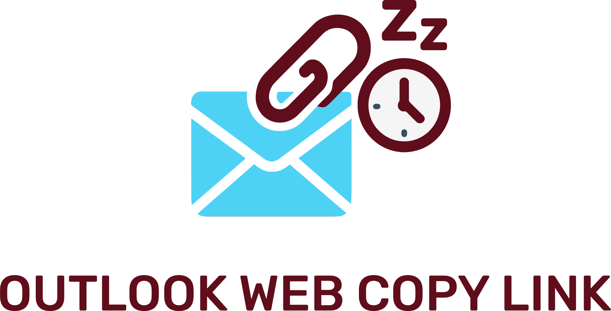
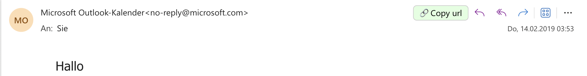

<picture>
  <source media="(prefers-color-scheme: dark)" srcset="images/logo_dark.svg" width="300">
  <source media="(prefers-color-scheme: light)" srcset="images/logo_light.svg" width="300">
  
</picture>

<h3 align="center">
    Chrome addon, that lets you copy Outlook Web URLs to specific Mails, so you can save the links in your notes and clean up your inbox.
</h3>

## 🚀 Installation via Chrome Web Store

- Option 1: Install directly from the [Chrome Web Store](https://chromewebstore.google.com/detail/outlook-web-copy-link/apfgdjfahgmocjbiiackcfhilgpcjgoe)
- Option 2: Download this repository and load it as an unpacked extension in Chrome.

## 🔥 Usage 

This addon will create a buttons in your Outlook web app.

If you click on it, it will create a unique url / link to this specific email. **The email can only be accessed by you !!**

*(Both App and Web work on iOS and Macbook. Not tested on Windows or Android yet).*

## 💙 Support 

#### 🐞  Found a bug? Missing a specific feature?
Feel free to file a new <a href="https://github.com/lennarto/outlook-web-copy-link/issues" target="_blank">Issue</a>.

#### 🤝 Contact me
I love building digital products, working in it-strategy, or applying ai in real-world use cases. On top of that, i create private it expert reports (🇩🇪 IT-Gutachten) for legal proceedings in germany, especially in criminal cases.
👉 [My website](https://lennie.de) 👈

#### 🍻 Buy me a beer 

If you’ve found something useful, feel free to fuel my next project with a Beer! 🍻 I do have a couple of cool ideas in my backlog 🚀
👉 [My Paypal](https://www.paypal.com/paypalme/ltoertzen) 👈